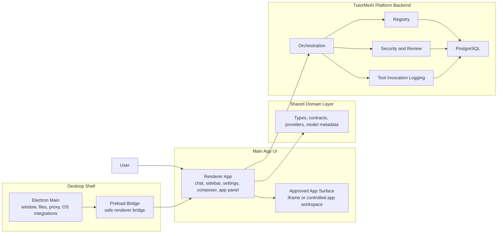

# Chatbox Community Edition

Chatbox Community Edition is a multi-provider AI workspace built on top of a desktop-first shell and extended with a newer TutorMeAI / ChatBridge platform direction.

This repository now supports two connected goals:

- a strong everyday AI workspace for chat, files, history, projects, and provider switching
- a trusted app-aware platform where approved third-party tools can run beside chat in a controlled way

## What This Repository Is

This repo is the working codebase for:

- the original Chatbox product experience
- the newer TutorMeAI / ChatBridge app platform work

In plain English, this is no longer only a chatbot.

It is becoming an AI workspace where:

- users can chat with many models in one place
- work can be organized into chats and projects
- approved apps can open beside the conversation
- app results can feed back into later chat turns
- trust and review rules can control which apps are allowed to launch

## Product Direction

The current direction is simple:

1. keep the core Chatbox workspace strong
2. add trusted app support on top of it
3. move app orchestration, trust, and logging into a backend-owned platform layer

That means the long-term product is not just "AI chat on desktop."

It is:

- a multi-provider AI workspace
- a tool-aware and app-aware assistant shell
- a foundation for trusted education and productivity workflows

## Built On Top Of Upstream Chatbox

Upstream Chatbox already provided a strong multi-provider chat workspace. This fork adds a second layer on top of that foundation:

- projects and cleaner workspace organization
- conversation-mode cleanup and easier onboarding
- voice input and a more responsive composer
- a governed approved-app catalog and right-side app workspace
- embedded runtime products such as Chess Tutor, Chess.com, Flashcards Coach, and Planner Connect
- shared app contracts and a reusable Apps SDK / cloud-plugin layer
- backend services for registry, orchestration, auth, security review, and tool logging
- trust, reviewer workflow, analytics, and education-oriented access controls

## Overview

Today, the repository includes:

- multi-provider chat
- local-first session history
- files, links, and image inputs
- knowledge base and MCP-style tool flows
- projects and organized chat lists
- conversation mode presets and onboarding
- voice input in the composer
- a responsive compose bar
- a right-side approved app panel
- example runtime apps such as Chess Tutor, Flashcards Coach, and Planner Connect
- backend foundations for registry, orchestration, security review, and tool invocation logging

## Documentation Map

If you are new to this repo, start here:

- [What We Built](./docs/what-we-built.md): concise before/after report, feature inventory, implementation map, and product packaging view
- [Docs Index](./docs/README.md): documentation by audience and topic
- [Apps SDK](./docs/sdk/README.md): the reusable app-platform SDK and cloud-plugin packaging model
- [UI Cleanup](./docs/ui-cleanup.md): what changed in the UX and how the interface was simplified
- [Architecture](./docs/architecture.md): system responsibilities, trust boundaries, and target deployment model
- [Setup Guide](./docs/tutormeai-setup-guide.md): how to run and verify the platform work inside this repo
- [Third-Party Developer Guide](./docs/tutormeai-third-party-developer-guide.md): how external apps integrate with the platform
- [Trust Docs](./docs/trust/README.md): approval, review-state, permission, and reviewer workflow guidance

## Current Stack

### Current repo implementation

- Language: TypeScript
- UI: React
- Desktop shell: Electron
- Build tool: `electron-vite`
- Routing: TanStack Router
- Data fetching: TanStack React Query
- State: Zustand and Jotai
- UI libraries: Mantine, MUI, Tailwind-style utility classes
- Testing: Vitest
- Packaging: `electron-builder`

### Platform direction

The intended production split is:

- client surface on Vercel
- backend orchestration service on Railway
- PostgreSQL for persistence

Inside this repository, those responsibilities are still modeled together in one codebase.

## Architecture

The easiest way to understand the system is:



### Architecture in plain English

- `src/main` owns native desktop behavior
- `src/preload` exposes a limited safe bridge to the UI
- `src/renderer` contains most product behavior and screens
- `src/shared` holds shared types, model contracts, and provider definitions
- `backend/` contains the newer platform services for app trust, orchestration, registry, and logging

## ICP And Personas

### Ideal customer profile

The best current fit is:

- AI power users who want one workspace for many model providers
- developers and prompt engineers who need files, tools, structured output, and iteration history
- researchers and analysts who work across long threads, documents, and web context
- education and workflow teams who need a trusted app-aware assistant shell, not just plain chat

### Key personas

#### 1. AI power user

Needs:

- fast model switching
- saved history
- reusable conversations
- strong keyboard and workflow support

#### 2. Developer or prompt engineer

Needs:

- provider comparison
- code and markdown-friendly rendering
- file and link context
- local models, MCP, and tool support

#### 3. Researcher or analyst

Needs:

- long-running context
- retrieval and document workflows
- saved threads and follow-up continuity

#### 4. Education workflow owner

Needs:

- safe approved app launches
- clear trust boundaries
- structured app context that can flow back into chat

#### 5. Everyday user

Needs:

- simple onboarding
- a clean composer
- voice input
- a workspace that feels polished without advanced setup

## What Is Implemented Today

### Core Chatbox workspace

- multi-provider AI chat
- local-first storage and durable session history
- threads, forks, exports, and settings depth
- files, links, images, web search, and knowledge-base support

### Workspace and UX improvements

- projects and chat grouping
- ChatGPT-style left sidebar structure
- clearer conversation mode entry point
- onboarding hint for conversation mode
- voice microphone input in the composer
- responsive narrow-layout composer behavior

### Approved app platform work

- approved app catalog
- multiple app integration modes
- right-side approved app panel
- automatic left-sidebar collapse when apps open
- resizable app panel
- embedded route fixes so the main shell does not render inside app views
- mode-aware approved app runtime behavior

### Example runtime app patterns

- Chess Tutor
- Flashcards Coach
- Planner Connect

### Shared platform contracts

- app manifest
- app session state
- tool schema
- runtime message envelope
- completion signal
- conversation app context

### Backend platform foundations

- app registry service
- orchestration service layer
- trust and review policy helpers
- launchability and origin checks
- reviewer workflow foundations
- tool invocation logging service

## Repo Map

### Main areas

- [`src/main`](./src/main): Electron main-process code
- [`src/preload`](./src/preload): preload bridge
- [`src/renderer`](./src/renderer): main product UI and workflows
- [`src/shared`](./src/shared): shared types, providers, contracts, utilities
- [`backend`](./backend): TutorMeAI platform backend domains
- [`docs`](./docs): architecture, trust, setup, audit, and planning docs

### New documentation entry points

- [`docs/what-we-built.md`](./docs/what-we-built.md): feature and implementation report for this fork
- [`docs/sdk/README.md`](./docs/sdk/README.md): Apps SDK and cloud-plugin model
- [`docs/ui-cleanup.md`](./docs/ui-cleanup.md): UI simplification and workspace cleanup
- [`docs/README.md`](./docs/README.md): docs index

### Important renderer areas

- [`src/renderer/components/InputBox`](./src/renderer/components/InputBox): composer, attachments, voice input, responsive behavior
- [`src/renderer/components/apps`](./src/renderer/components/apps): approved app panel and workspace
- [`src/renderer/components/message-parts`](./src/renderer/components/message-parts): embedded app host and message rendering
- [`src/renderer/routes/embedded-apps`](./src/renderer/routes/embedded-apps): example embedded app routes
- [`src/renderer/packages/tutormeai-apps`](./src/renderer/packages/tutormeai-apps): local runtime app orchestration helpers

### Important backend areas

- [`backend/registry`](./backend/registry): approved app registration and lookup
- [`backend/orchestration`](./backend/orchestration): tool discovery, app context, injection, routing
- [`backend/security`](./backend/security): trust, launchability, review, policies
- [`backend/tool-invocations`](./backend/tool-invocations): invocation lifecycle logging
- [`backend/db`](./backend/db): schema and migrations

## Getting Started

### Requirements

- Node.js `^20.19.0 || >=22.12.0 <23.0.0`
- `pnpm >= 10`

### Install

```bash
pnpm install
```

### Run the desktop shell

```bash
pnpm run dev
```

### Build the desktop app

```bash
pnpm run build
```

### Build and preview the web version

```bash
pnpm run build:web
pnpm run serve:web
```

### Run tests

```bash
pnpm run test
```

### Run lint and type checks

```bash
pnpm run lint
pnpm run check
```

## TutorMeAI And App-Platform Verification

High-value app platform checks:

```bash
pnpm exec vitest run \
  src/shared/contracts/v1/index.test.ts \
  src/renderer/components/message-parts/embedded-app-runtime.test.ts \
  test/integration/tutormeai/app-lifecycle.test.tsx \
  test/integration/tutormeai/routing-scenarios.test.ts
```

## Key Docs

- [TutorMeAI architecture](./docs/architecture.md)
- [TutorMeAI setup guide](./docs/tutormeai-setup-guide.md)
- [TutorMeAI third-party developer guide](./docs/tutormeai-third-party-developer-guide.md)
- [TutorMeAI trust docs](./docs/trust/README.md)
- [TutorMeAI demo checklist](./docs/tutormeai-demo-checklist.md)
- [App integration matrix](./docs/app-integration-matrix.md)
- [Codebase audit](./docs/codebase-audit/README.md)
- [Storage notes](./docs/storage.md)

## Current State Of The Repo

This repository already contains meaningful working product code.

It also contains platform-foundation work that is preparing for a stronger long-term split between:

- user-facing client experience
- trusted backend orchestration
- approved app runtime and governance

So the best way to think about the repo today is:

- mature AI workspace shell
- active app-platform buildout
- strong documentation and trust-model direction

## Contributing

Contributions are welcome in:

- product features
- bug fixes
- tests
- documentation
- architecture cleanup
- trust and app-platform work

Before opening a PR, it helps to:

1. run the relevant tests
2. run lint or type checks for the touched area
3. update docs when changing architecture, contracts, or user-facing behavior

## Bottom Line

Chatbox Community Edition is evolving from a strong AI client into a trusted AI workspace platform.

The core chat experience is already real.
The app-aware platform layer is now real enough to demo, test, and keep building.
