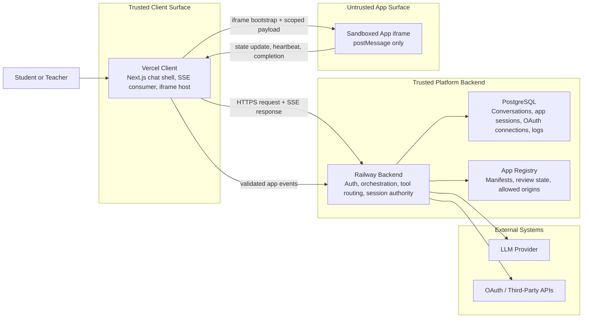
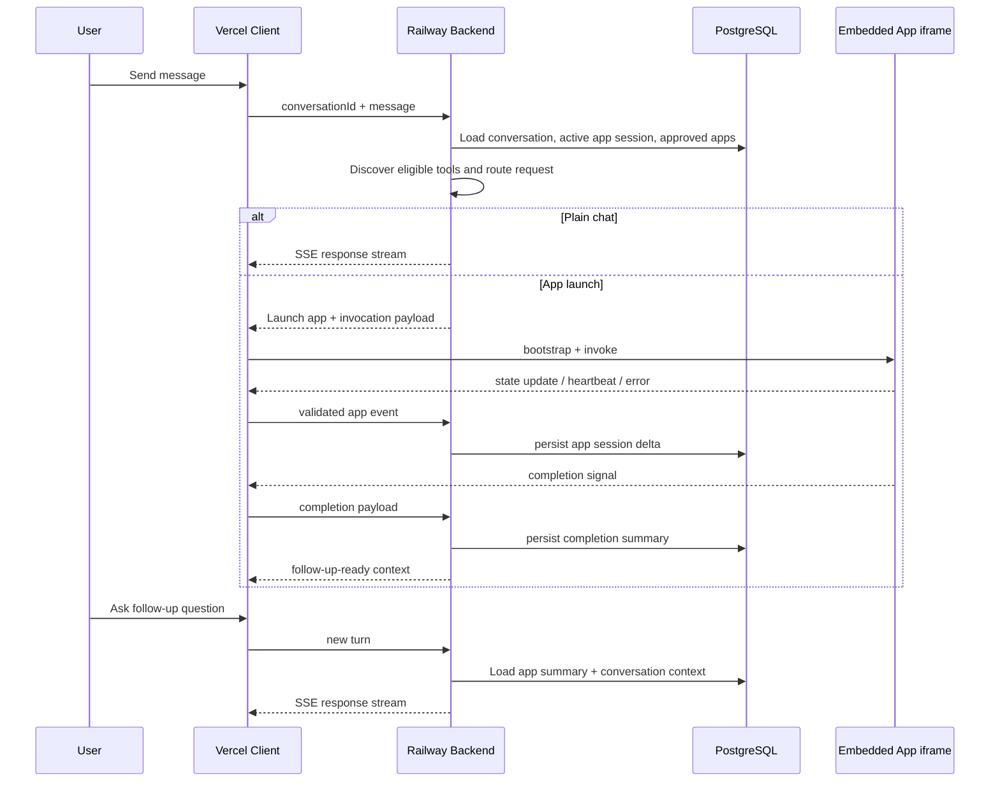
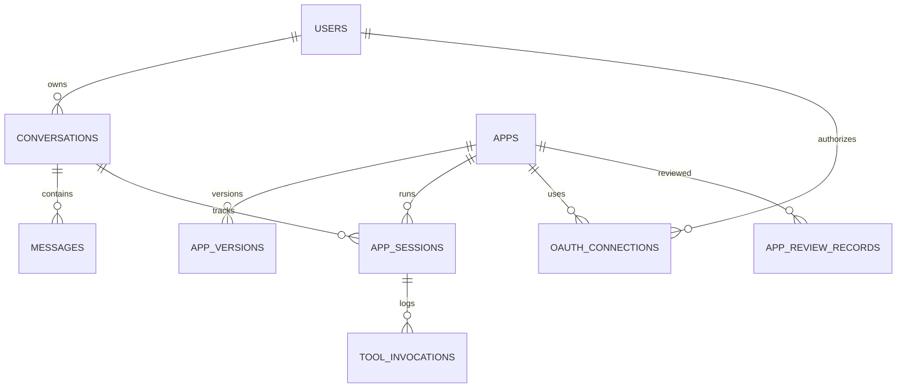

# TutorMeAI Architecture

## Objective

This document is the canonical system architecture for the TutorMeAI third-party app platform. It defines:

- the system components
- the lifecycle from user request to app completion and follow-up
- chat state vs app state ownership
- trust boundaries between the platform and third-party apps
- the initial folder ownership map for implementation

This document is the source of truth for Phase 0 Tickets 01 and 07. If a later ticket changes a shared contract or runtime boundary, this file must be updated in the same change.

## Final Stack

- Frontend / client: Next.js on Vercel
- Backend / API / orchestration: Node.js service on Railway
- Database: PostgreSQL
- Realtime streaming: Server-Sent Events (SSE)
- Embedded app runtime: iframe + postMessage
- Authentication: platform authentication plus per-app OAuth handled by the Railway backend

## Current Codebase Fit

The current Chatbox repo is a strong client-shell starting point, but the new TutorMeAI platform needs a backend-owned orchestration layer.

Relevant current code owners:

- Chat session orchestration: `src/renderer/stores/session/generation.ts`
- Session public API: `src/renderer/stores/session/index.ts`
- Message streaming and tool setup: `src/renderer/packages/model-calls/stream-text.ts`
- Prompt-engineered tool handling helpers: `src/renderer/packages/model-calls/tools.ts`
- Closest existing iframe pattern: `src/renderer/components/Artifact.tsx`

Architectural implication:

- The current renderer code is the reference interaction shell, not the long-term orchestration authority.
- The Railway backend becomes the system of record for app registry, routing, app sessions, auth, and invocation logs.
- Shared contracts live in `src/shared/contracts/` until the client and backend are split into separate deployable surfaces.

## Contract Package Status

Phase 0 now has implemented v1 contracts for:

- `AppManifest`
- `AppSessionState`
- `ToolSchema`
- `EmbeddedAppMessage`
- `CompletionSignal`
- `ConversationAppContext`

These contracts unblock downstream registry, iframe runtime, and completion-context work. Backend and frontend feature tickets should consume these exports directly rather than defining parallel payload shapes.

## Runtime Observability

Runtime tracing and Braintrust export are documented in `docs/runtime-observability.md`.

That document is the source of truth for:

- the runtime trace tree
- what spans we emit
- what metadata and metrics we export
- how to read a live Braintrust trace
- what product and debugging insights the traces provide

## System Components

### 1. Vercel Client

Responsibilities:

- render the chat shell
- stream assistant responses over SSE
- render embedded third-party apps inside iframe containers
- maintain UI-only local state such as view state, optimistic loading state, and active panel selection
- broker validated postMessage traffic between iframe containers and the Railway backend

Must not own:

- third-party OAuth tokens
- app approval decisions
- durable app session state
- durable invocation logging
- final tool-routing decisions

### 2. Railway Backend

Responsibilities:

- user/platform authentication
- per-app OAuth start, callback, token storage, and token refresh
- app registry and manifest validation
- tool discovery and tool routing
- app session persistence
- conversation persistence
- completion handling and follow-up context assembly
- invocation logging, failure tracking, and policy enforcement

This is the orchestration authority for the platform.

### 3. PostgreSQL

Persistent stores:

- users
- platform_sessions
- conversations
- messages
- apps
- app_versions
- app_sessions
- tool_invocations
- oauth_connections
- app_review_records

Phase 3 auth/security adds two important persistence rules:

- `platform_sessions` stores hashed platform session secrets plus rotation metadata owned by the Railway backend
- `oauth_connections` stores callback state hashes, PKCE verifier ciphertext, token ciphertext, and refresh metadata for authenticated third-party apps

### 4. Embedded App Runtime

Responsibilities:

- render approved app UIs inside sandboxed iframes
- receive bootstrap and invocation payloads
- send state updates, heartbeats, errors, and completion messages

Hard boundary:

- apps are guests
- the platform is the source of truth

## Trust Boundaries

### Platform Boundary

The Vercel client and Railway backend are trusted platform surfaces. The client is trusted for UI rendering. The backend is trusted for identity, orchestration, state persistence, and auth decisions.

### Third-Party App Boundary

Third-party apps are untrusted by default and run inside iframe sandboxes. They do not receive:

- full conversation history by default
- direct access to parent DOM
- direct access to platform tokens
- direct access to unrelated app sessions

All app communication must go through validated postMessage envelopes with session identifiers, correlation IDs, and origin checks.

## Runtime Lifecycle

### Happy Path

1. User sends a message in the Vercel client.
2. Railway backend loads the current conversation, active app context, approved apps, and eligible tools.
3. Backend performs tool discovery and routing.
4. If plain chat is sufficient, the backend streams the response over SSE.
5. If an app should launch, the backend returns an app-launch instruction plus app/runtime metadata.
6. Client renders an iframe container for the selected app.
7. Client sends a bootstrap message and any structured invocation payload to the iframe.
8. App sends state updates and optional heartbeats through postMessage.
9. Client validates the message origin and forwards durable state deltas to the Railway backend.
10. When the app completes, it emits a CompletionSignal.
11. Backend stores the completion summary, updates app session state, and makes follow-up context available to the next chat turn.
12. User asks a follow-up question, and the backend injects compact app summaries into the model context.

### Failure and Recovery Path

1. App iframe fails to load, times out, or emits an invalid message.
2. Client shows a clear failure state with retry and continue-chat options.
3. Backend marks the invocation or app session as failed with a normalized error type.
4. Assistant explains the failure and offers next actions.
5. If the user refreshes, the client reloads the conversation and asks the backend for the latest app-session snapshot.

## System Architecture Diagram

## Plugin Lifecycle Sequence

## State Ownership Model

### Chat State

Owner: Railway backend

Contents:

- conversations
- persisted messages
- message ordering
- chat-level metadata

Client may cache chat state for UX, but the backend remains authoritative.

### App Session State

Owner: Railway backend

Contents:

- active app id per conversation
- resumable app session snapshot
- app status (`active`, `completed`, `failed`, `expired`)
- structured app state summaries
- completion summaries

The client can hold transient render state, but not the durable source of truth.

### Auth State

Owner: Railway backend

Contents:

- platform user session
- per-app OAuth connections
- encrypted token material
- hashed platform session tokens
- token refresh status

### Invocation History

Owner: Railway backend

Contents:

- appId
- toolName
- toolCallId
- sessionId
- conversationId
- status
- latency
- timestamps
- input/output references

## State Model ERD

## Folder Ownership Map

### Existing Reference Surfaces

- `src/renderer/**`: current client-shell reference code
- `src/main/**`: desktop runtime reference only, not the future app-platform backend
- `src/shared/**`: shared types and utilities already used across the app

### New Contract Source of Truth

- `src/shared/contracts/**`: all cross-surface TutorMeAI contracts

### Planned Future Delivery Boundaries

- Vercel client work should stay conceptually separate from Railway backend work, even before the repo is physically split.
- Until the repo split exists, agents must treat `src/shared/contracts/**` as the only stable cross-boundary package.
- `backend/**` is the Railway backend implementation surface for PostgreSQL schema, migrations, registry services, persistence services, auth, and orchestration work.

## Non-Negotiable Rules for Downstream Agents

- Do not put durable app session state in chat message blobs.
- Do not let third-party apps own OAuth tokens.
- Do not bypass the typed postMessage envelope.
- Do not treat iframe apps as trusted.
- Do not introduce shared interfaces outside `src/shared/contracts/**`.
