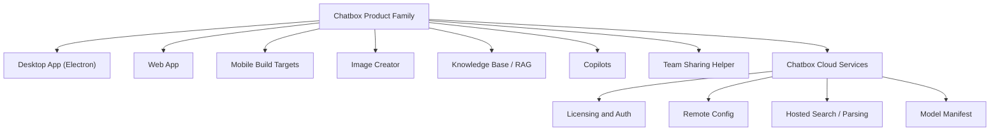
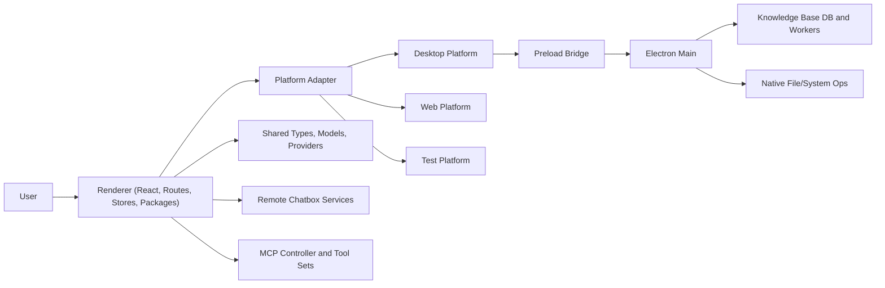
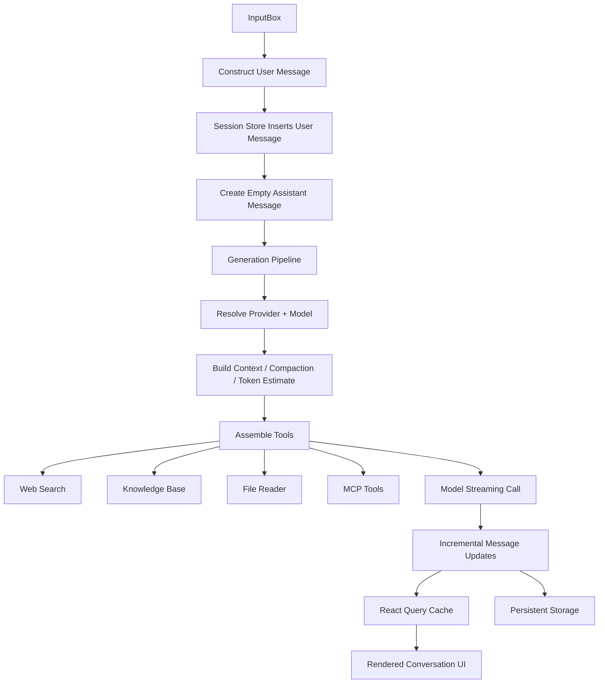
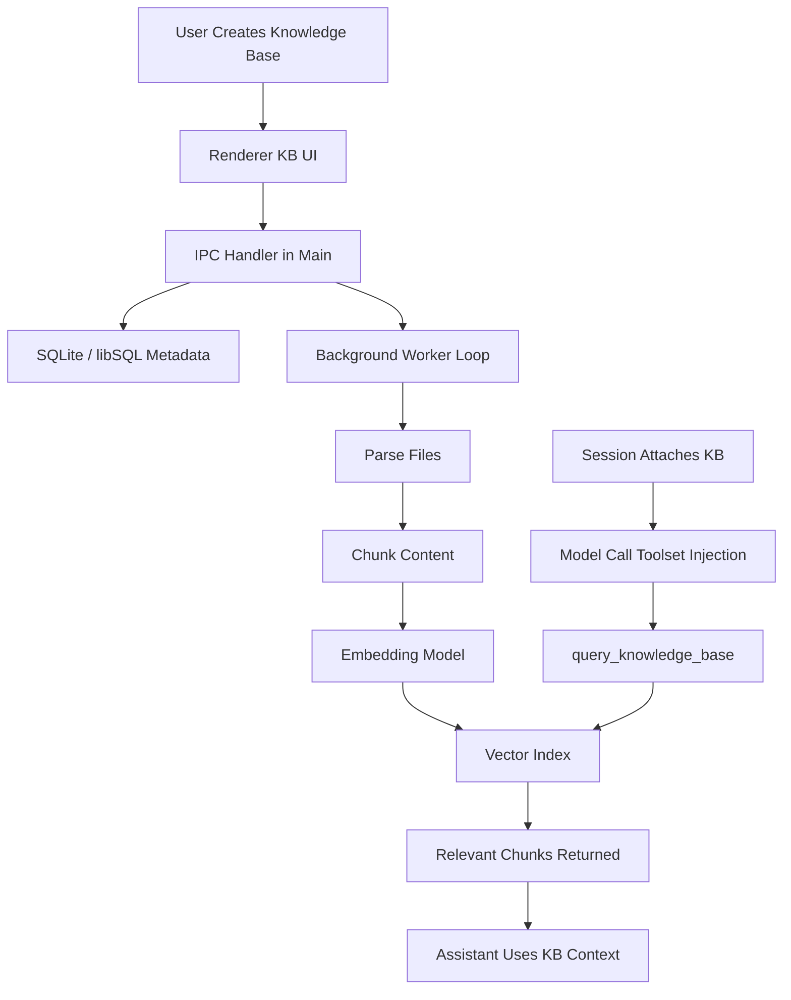
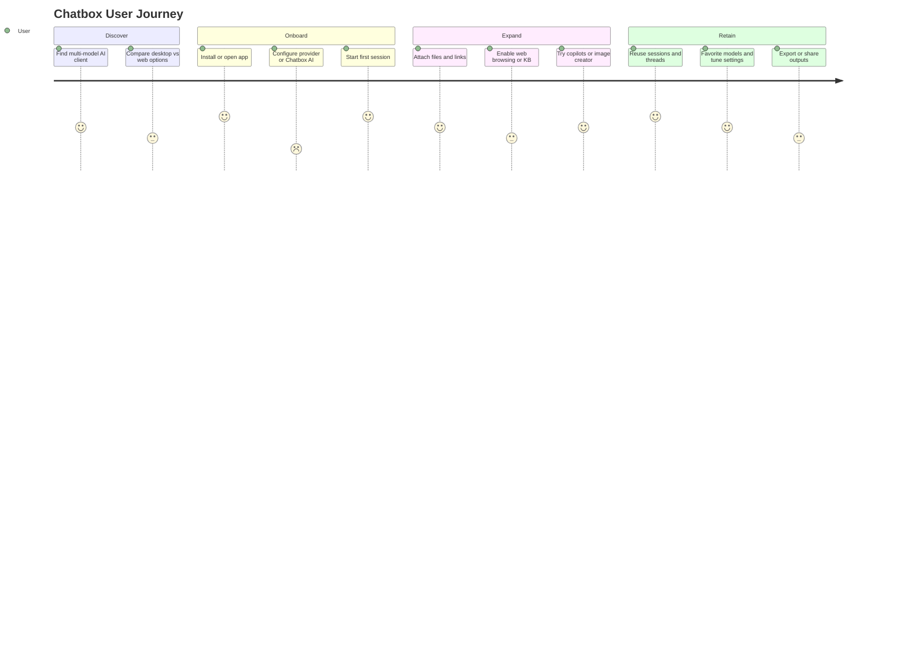

# Mermaid Diagrams

## 1. Product Portfolio

```mermaid
flowchart TD
    A["Chatbox Product Family"]
    A --> B["Desktop App (Electron)"]
    A --> C["Web App"]
    A --> D["Mobile Build Targets"]
    A --> E["Image Creator"]
    A --> F["Knowledge Base / RAG"]
    A --> G["Copilots"]
    A --> H["Team Sharing Helper"]
    A --> I["Chatbox Cloud Services"]

    I --> I1["Licensing and Auth"]
    I --> I2["Remote Config"]
    I --> I3["Hosted Search / Parsing"]
    I --> I4["Model Manifest"]
```

## 2. Runtime Architecture

```mermaid
flowchart LR
    U["User"] --> R["Renderer (React, Routes, Stores, Packages)"]
    R --> P["Platform Adapter"]
    R --> S["Shared Types, Models, Providers"]
    R --> X["Remote Chatbox Services"]
    R --> M["MCP Controller and Tool Sets"]

    P --> D["Desktop Platform"]
    P --> W["Web Platform"]
    P --> T["Test Platform"]

    D --> L["Preload Bridge"]
    L --> E["Electron Main"]
    E --> K["Knowledge Base DB and Workers"]
    E --> F["Native File/System Ops"]
```

## 3. Chat Request Pipeline

```mermaid
flowchart TD
    A["InputBox"] --> B["Construct User Message"]
    B --> C["Session Store Inserts User Message"]
    C --> D["Create Empty Assistant Message"]
    D --> E["Generation Pipeline"]
    E --> F["Resolve Provider + Model"]
    F --> G["Build Context / Compaction / Token Estimate"]
    G --> H["Assemble Tools"]
    H --> H1["Web Search"]
    H --> H2["Knowledge Base"]
    H --> H3["File Reader"]
    H --> H4["MCP Tools"]
    H --> I["Model Streaming Call"]
    I --> J["Incremental Message Updates"]
    J --> K["React Query Cache"]
    J --> L["Persistent Storage"]
    K --> M["Rendered Conversation UI"]
```

## 4. Knowledge Base Ingestion and Retrieval

```mermaid
flowchart TD
    A["User Creates Knowledge Base"] --> B["Renderer KB UI"]
    B --> C["IPC Handler in Main"]
    C --> D["SQLite / libSQL Metadata"]
    C --> E["Background Worker Loop"]
    E --> F["Parse Files"]
    F --> G["Chunk Content"]
    G --> H["Embedding Model"]
    H --> I["Vector Index"]

    J["Session Attaches KB"] --> K["Model Call Toolset Injection"]
    K --> L["query_knowledge_base"]
    L --> I
    I --> M["Relevant Chunks Returned"]
    M --> N["Assistant Uses KB Context"]
```

## 5. Customer Journey

```mermaid
journey
    title Chatbox User Journey
    section Discover
      Find multi-model AI client: 4: User
      Compare desktop vs web options: 3: User
    section Onboard
      Install or open app: 5: User
      Configure provider or Chatbox AI: 2: User
      Start first session: 5: User
    section Expand
      Attach files and links: 4: User
      Enable web browsing or KB: 3: User
      Try copilots or image creator: 4: User
    section Retain
      Reuse sessions and threads: 5: User
      Favorite models and tune settings: 4: User
      Export or share outputs: 3: User
```
