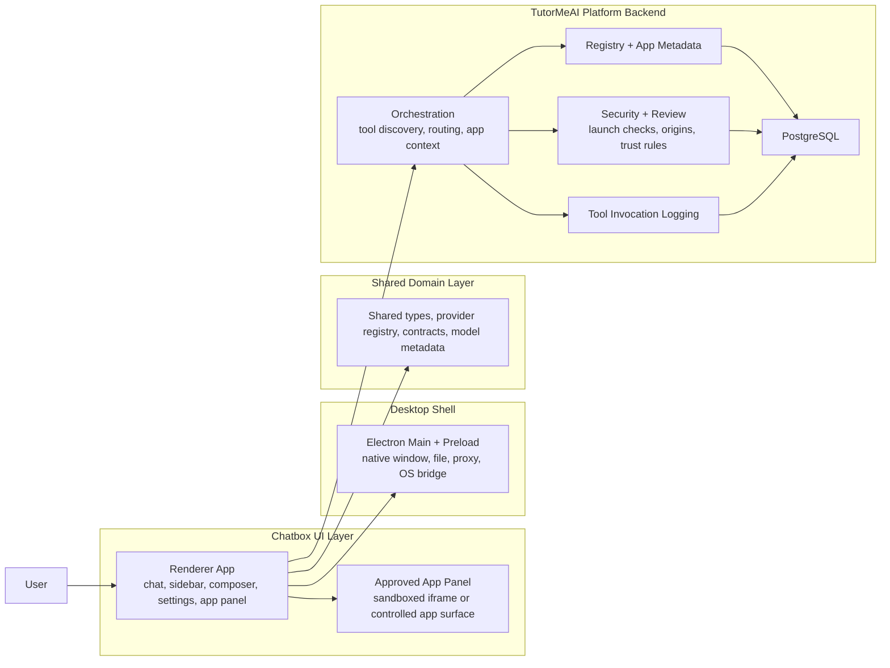

# Chatbox / TutorMeAI Progress Report

## Plain-English Summary

This repo is no longer only a desktop AI chat app.

It is now two things at the same time:

1. the original Chatbox product, which gives users a strong multi-provider AI workspace
2. a newer TutorMeAI / ChatBridge platform layer, which adds approved third-party apps, app runtime rules, trust controls, and backend orchestration

I scanned the full tracked repo inventory before writing this summary:

- 936 tracked files total
- 688 files under `src`
- 89 files under `backend`
- 59 files under `docs` and `doc`

The deep-read focus was on the architecture docs, the main runtime entry points, the current UI shell, the app workspace, the approved app catalog, and the backend security / orchestration / registry / logging modules.

## What We Have Built So Far

### 1. A real multi-provider AI workspace

The original Chatbox foundation is already strong.

Users can:

- talk to different model providers from one UI
- keep conversation history
- save settings locally
- attach files, images, and links
- use web search, knowledge base, and MCP-style tool flows
- keep working across desktop and web-style surfaces

Why this matters:

- it reduces vendor lock-in
- it turns AI work into something reusable, not disposable
- it gives us a strong shell to extend instead of starting from zero

### 2. A layered architecture, not one giant page

The codebase is split into clear layers:

#### Electron main

This handles desktop-only powers such as:

- app lifecycle
- native window behavior
- updater, tray, shortcuts, proxy, and file parsing

#### Preload bridge

This exposes a limited safe bridge between the desktop shell and the UI.

#### Renderer app

This is where most product behavior lives:

- routes
- chat UI
- settings
- sidebar
- compose box
- app panels
- session workflows

#### Shared domain layer

This holds:

- shared types
- provider definitions
- contracts
- model metadata
- request helpers

#### Backend platform layer

This is the newer TutorMeAI-oriented backend slice for:

- app registry
- security and trust checks
- orchestration
- app sessions
- tool invocation logging

### 3. A ChatGPT-style workspace shell

The left sidebar is now more structured and closer to a modern chat workspace:

- `New Chat`
- `Search chats`
- `Projects`
- `Your chats`

There is also support for:

- creating projects
- grouping chats into projects
- moving chats into projects

Why this matters:

- users can organize work by topic, client, or class
- the UI feels more familiar and easier to explain in demos
- it prepares the product for more serious multi-workspace usage

### 4. Conversation Mode and better onboarding

The chat composer now includes a clearer conversation-mode entry point instead of burying the feature as a vague settings control.

We also added onboarding behavior so the user is nudged to notice it on new chat and project flows.

Why this matters:

- it makes presets and guided modes easier to discover
- it reduces hidden-feature problems
- it makes the product easier to demo to new people

### 5. Voice input in the compose bar

The composer now has a microphone control for voice dictation.

This uses browser speech recognition to turn spoken input into text inside the compose box.

Why this matters:

- it makes the product feel more modern and multimodal
- it lowers friction for quick prompting
- it helps the UI feel closer to mobile-style AI apps

### 6. A responsive compose bar

The input bar now responds to its own width, not only to whole-screen mobile breakpoints.

When space gets tight, especially with the app panel open, the composer shifts into a more compact layout instead of cramming all controls into one line.

Why this matters:

- it prevents overlap and crowding
- it makes the layout feel stable during demos
- it keeps the product usable when the right-side app panel is open

### 7. An approved app platform inside chat

This is one of the biggest accomplishments in the repo.

We now have an approved app catalog with multiple integration strategies, not just one generic iframe idea.

The catalog supports different app modes:

- `runtime`
- `partner-embed`
- `api-adapter`
- `district-adapter`
- `browser-session`
- `native-replacement`

Why this matters:

- not every education tool can be embedded the same way
- some vendors allow embeds
- some need district-specific launch URLs
- some need ChatBridge-owned UI backed by APIs
- some need a controlled browser session instead of a direct iframe

This is an important architectural step because it shows the team is thinking in real product terms, not just technical demos.

### 8. A right-side approved app panel

Approved apps can now open in a right-side panel instead of taking over the whole chat.

Recent UX work improved this area:

- the panel is resizable
- the left sidebar auto-collapses when the app opens
- embedded app routes no longer accidentally render the full Chatbox shell inside the panel
- the panel has mode-aware behavior for different app types

Why this matters:

- chat stays visible while the app is open
- the product starts to feel like a real multi-surface workspace
- app workflows no longer feel bolted on

### 9. TutorMeAI runtime apps are not only theory

The repo includes concrete runtime app patterns, including:

- Chess Tutor
- Flashcards Coach
- Planner Connect

These are important because they demonstrate different app behaviors:

- pure runtime interaction
- structured study flow
- authenticated planner-style workflow

Why this matters:

- demos can show actual live behavior
- the architecture is proven with real examples
- the app platform is no longer just a design document

### 10. Typed embedded app contracts

The shared contract package now includes typed schemas for the embedded app platform, including:

- app manifests
- app session state
- tool schemas
- runtime messages
- completion signals
- conversation app context

Why this matters:

- host and app communication stays structured
- backend and frontend can share the same shapes
- later tickets do not need to invent ad hoc payloads

This is a quiet but important achievement. Typed contracts are what keep an app platform from becoming messy and fragile.

### 11. Security, trust, and review foundations

The backend security slice is a serious part of the progress so far.

The repo now includes foundations for:

- review records
- review workflow concepts
- approval synchronization
- launchability checks
- origin and domain validation
- permission sanity checks
- OAuth scope checks
- deterministic iframe security policy generation
- security header generation

Why this matters:

- third-party education apps are a trust problem, not just a UI problem
- iframe safety depends on strict origin and sandbox control
- app approval needs human review and policy, not only automation

This is one of the strongest strategic signals in the repo: the product is being built with governance in mind, not just integration excitement.

### 12. Backend orchestration foundations

There is now a backend orchestration layer that is separate from the renderer.

Current orchestration modules cover:

- tool discovery
- app context assembly
- tool injection
- tool routing

Why this matters:

- tool routing policy should not live only in the client
- app-aware follow-up behavior needs a backend-owned source of truth
- this is the path toward reliable chat-plus-app orchestration

### 13. Tool invocation logging

There is now a backend service for tool invocation logging with lifecycle states such as:

- queue
- start
- complete
- fail
- cancel
- timeout

Why this matters:

- auditability
- debugging
- failure recovery
- future cost tracking
- platform trust

This is one of the strongest signs that the platform is moving from prototype thinking to production thinking.

## Simple Architecture Explanation

Here is the easiest way to explain the current architecture:

### In plain English

- the renderer is the main user-facing app
- Electron adds desktop powers when we are running the desktop build
- the shared layer keeps models, contracts, and types consistent
- the backend platform layer owns app trust, registry, routing, and audit records
- approved apps run in a controlled side panel instead of being fully trusted inside the main UI

## What Has Been Accomplished Recently

Recent merged work on `main` shows fast progress in four visible areas:

### A. App workspace improvements

- resizable approved app panel
- better sidebar behavior when apps open
- fixed embedded routes so the full app shell does not appear inside the app iframe
- app integration matrix added to clarify how each approved app should really work

### B. Composer improvements

- microphone voice input
- responsive composer behavior in narrow layouts

### C. Runtime and app polish

- better approved-app runtime handling
- restored readable runtime behavior for the Chess Tutor path

### D. Documentation and planning maturity

- architecture docs
- state model docs
- trust governance docs
- integration matrix
- demo checklist

This means the repo is improving in both code and narrative. That matters for demos, onboarding, and future contributors.

## Why This Work Matters

The short version is this:

- Chatbox gives us the strong AI workspace shell
- TutorMeAI / ChatBridge gives us the app-aware platform direction
- the combined system is moving toward a product where chat, tools, approved apps, and follow-up context all work together

That is more valuable than a normal chatbot because it can become:

- a student workspace
- a teacher workflow hub
- a project-based AI assistant
- a controlled app launcher with memory and context

## Honest Reality Check

This repo is making strong progress, but it still carries two identities at once:

1. the original Chatbox product
2. the newer TutorMeAI platform architecture

That is not necessarily bad, but it does mean:

- some parts are mature product code
- some parts are platform foundations
- some parts are still architecture-led and documentation-led

So the right demo story is not:

- `everything is finished`

The right demo story is:

- `we already have a working AI workspace`
- `we have now added the foundations for a trusted app platform inside that workspace`
- `the repo shows both visible UX wins and serious backend groundwork`

## Demo Video Talk Track

Use this as a simple video script in plain English.

### Opening

`This started as Chatbox, a strong multi-provider AI workspace. What we have done now is extend it into an app-aware platform, so chat can work together with approved third-party tools instead of staying a plain text box.`

### Part 1: show the workspace

`On the left, users can now organize work with projects and chats. The layout is cleaner and more familiar, closer to modern AI workspaces.`

### Part 2: show the compose bar

`At the bottom, the compose bar now supports voice dictation and responsive behavior. That means the input stays usable even when the screen gets tight or an app panel is open.`

### Part 3: show an approved app

`The biggest change is the approved app platform. When an app opens on the right, the chat stays in place and the app opens in a controlled side panel. The left sidebar collapses automatically to give the app more room.`

### Part 4: explain app strategy

`We are not treating every vendor app the same way. Some apps are runtime apps we host, some are partner embeds, some need API adapters, and some are district-managed integrations. That is important because real education tools have different technical and trust requirements.`

### Part 5: explain safety

`The trust model matters here. Apps are treated as guests, not as trusted first-class code. We use typed contracts, sandboxed iframe rules, origin validation, review workflow foundations, and launchability checks so the platform stays controlled.`

### Part 6: explain backend foundations

`Behind the scenes, we now have backend foundations for registry, orchestration, security, and tool invocation logging. That gives us the path to reliable app routing, auditing, and recovery instead of putting all logic in the client.`

### Part 7: close with outcome

`So the result so far is not just a nicer chat UI. It is a real step toward a trusted AI workspace where chat, tools, and approved apps can work together in one product.`

## Recommended Demo Flow

If you want a simple live sequence, use this order:

1. Show the sidebar and explain projects and chats.
2. Show the compose bar and point out voice input.
3. Launch an approved app such as Chess Tutor or Planner Connect.
4. Point out that the sidebar collapses and the app opens in the right panel.
5. Explain that the app is running in a controlled embedded surface, not as trusted parent-page code.
6. Mention the backend layers: registry, security, orchestration, and logging.
7. End with the product vision: one AI workspace, many providers, app-aware follow-up, and a trust model strong enough for education use cases.

## Bottom Line

The clearest one-sentence summary is:

Chatbox has grown from a strong AI chat client into the foundation of a trusted, app-aware AI workspace.
