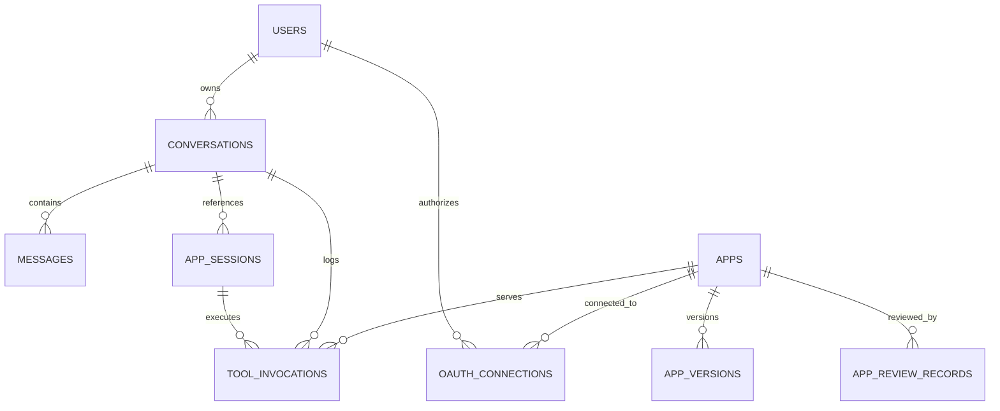

# TutorMeAI State Model

## Purpose

This document defines the source-of-truth model for conversation state, app session state, auth state, and invocation history. These domains must remain separate so the system can support app-aware chat, resumable sessions, secure OAuth handling, and reliable auditing.

## Source of Truth Matrix

| Domain | Primary Owner | Durable Store | Client Cache Allowed | Notes |
| --- | --- | --- | --- | --- |
| Conversation state | Railway backend | PostgreSQL | Yes | Messages and thread metadata persist across sessions |
| App session state | Railway backend | PostgreSQL | Yes | The client may cache the latest snapshot but is not authoritative |
| Auth state | Railway backend | PostgreSQL / secure secret store | No for long-lived tokens | Platform auth and per-app OAuth remain server-owned |
| Tool invocation history | Railway backend | PostgreSQL | No | Required for auditing, retries, QA, and cost analysis |
| Registry metadata | Railway backend | PostgreSQL | Read-only cache allowed | Client only consumes approved app/tool views |

## Domain Definitions

### Conversation State

Includes:

- conversation record
- message list
- thread/fork metadata
- active app references
- completion summaries attached to the conversation timeline

Rules:

- Raw app event logs do not become first-class conversation messages by default.
- Only curated app summaries and completion records are injected into the LLM context.

### App Session State

Includes:

- app session identifier
- app status: `pending`, `active`, `completed`, `failed`, `expired`
- latest validated app snapshot
- sequencing metadata
- resumability TTL

Rules:

- One active app session per conversation thread at a time for MVP.
- Multiple inactive or completed app sessions may exist in a single conversation history.
- App iframes may hold transient local interaction state, but only validated state persisted through the host/backend is durable.

### Auth State

Includes:

- TutorMeAI platform session
- app OAuth connection status
- provider scopes
- access token expiry
- refresh token metadata

Rules:

- Platform auth and per-app OAuth are distinct records.
- OAuth tokens are never sourced from embedded app local storage.
- The client only receives minimal auth status needed for UX, not raw long-lived secrets.

### Tool Invocation History

Includes:

- invocation identifier
- conversation ID
- app session ID
- app ID
- tool name
- input reference
- output reference
- latency
- normalized status and error details

Rules:

- Every invocation must be traceable by `conversationId`, `appId`, `toolCallId`, `sessionId`, and `userId`.
- Invocation history is append-only for auditing, even if a latest-status index is maintained separately.

## Persistence Rules

### On Chat Send

- Persist the user message.
- Load current active app session summary if present.
- Load eligible tools and auth readiness.

### On App Launch

- Create an app session record.
- Create a tool invocation record tied to the launch.
- Persist the initial session status before the iframe becomes interactive.

### On App State Update

- Validate the incoming message envelope.
- Persist only the latest approved state snapshot and key derived summaries.
- Reject malformed or out-of-order state updates.

### On Completion

- Persist the completion signal.
- Update app session status to `completed`.
- Attach a completion summary reference to the conversation context.

### On Failure

- Persist a normalized error record.
- Update app session status to `failed`.
- Keep the conversation resumable even if the app is not.

## Recovery Rules

### Browser Refresh

- Reload conversation state from PostgreSQL through the backend.
- Reload the latest active app session snapshot.
- Re-render the client from backend state, not browser-local assumptions.

### SSE Reconnect

- Resume assistant streaming if supported by the request lifecycle.
- If the prior stream is no longer active, fetch the latest durable conversation state and render the final settled output.

### App Resume

- Resume only from the last validated backend snapshot.
- Expired app sessions fall back to completion summary or failure summary behavior.

## Entity Relationships

## Ticket 07 Acceptance Mapping

- Conversation state and app session state have separate owners.
- Auth state is isolated from both chat and app state.
- Invocation history is its own durable log.
- Refresh and reconnect behavior are defined.
- Multi-app history is supported without collapsing everything into a single JSON blob.
