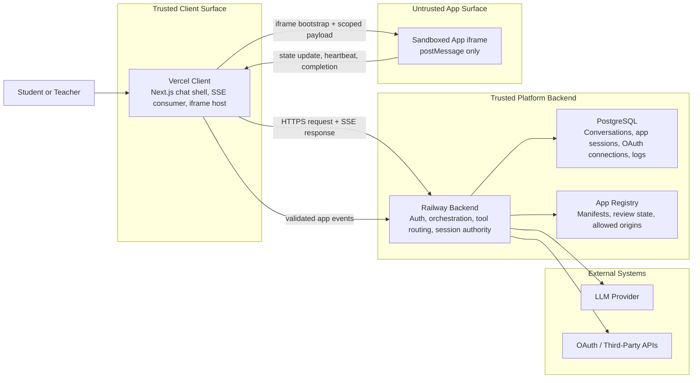

# TutorMeAI Pre-Search

## Phase 1: Define Your Constraints

### 1. Scale & Load Profile

#### Users at launch? In 6 months?

At launch, I would plan for a controlled beta of roughly 500-1,500 monthly active users and around 50-150 concurrent users during peak classroom hours. In 6 months, if the platform proves stable, I would design for 10,000-25,000 monthly active users and 500-1,500 concurrent users. Even though TutorMeAI already serves a much larger education footprint, this feature is new and should launch in a staged way because third-party app orchestration introduces more failure modes than plain chat.

#### Traffic pattern: steady, spiky, or unpredictable?

Traffic will be spiky and schedule-driven, not flat. K-12 usage tends to cluster around class periods, mornings, and assignment windows. I would assume short bursts of concurrent sessions rather than evenly distributed usage. That means the system needs elastic handling for chat requests, app rendering, and tool routing.

#### How many concurrent app sessions per user?

For MVP, I would design for 1 active embedded app session per conversation thread, with support for multiple app sessions across the full conversation history. This keeps context management much simpler and still satisfies the requirement that a user can switch between multiple apps in one conversation. Internally, older app sessions remain resumable, but only one is "active" at a time.

#### Cold start tolerance for app loading?

Cold start tolerance should be low. The user should see initial UI feedback in under 1 second, even if the embedded app itself takes 2-4 seconds to fully hydrate. The case explicitly says users will expect reasonable response times and visible progress indicators, so I would use loading states, skeletons, and status text instead of requiring every app to load instantly.

### 2. Budget & Cost Ceiling

#### Monthly spend limit?

For MVP, I would set a target ceiling of $500-$1,500/month all-in for hosting, auth, database, and LLM usage during early testing. That is high enough to iterate safely but low enough to force disciplined design choices around token usage, logging, and app orchestration.

#### Pay-per-use acceptable or need fixed costs?

Pay-per-use is acceptable for MVP, especially for LLM calls and possibly auth or hosting, because it reduces upfront risk and matches early-stage uncertainty. Once usage stabilizes, I would re-evaluate fixed-cost infrastructure for the database and app hosting, but not before the plugin architecture is proven.

#### LLM cost per tool invocation acceptable range?

For MVP, I would target $0.005-$0.03 per tool-routed turn on average. Some turns will be plain chat and cheaper; others will include dynamic tool discovery plus app context. The goal is not perfect optimization in week one, but keeping tool-routed interactions bounded enough that the required production cost analysis looks credible. The case explicitly requires tracking actual API costs, token counts, API calls, and projecting costs across user tiers, so this decision must be defendable.

#### Where will you trade money for time?

I would spend money to save time in four places: reliable hosted auth, managed database, managed deployment, and a strong function-calling model. I would not spend time building custom auth, custom model orchestration infrastructure, or overly complex hosting. I would save engineering time for the hardest part of the case: the plugin interface, completion signaling, and context retention. That matches the build guidance in the case.

### 3. Time to Ship

#### MVP timeline?

The case sets a 24-hour MVP + pre-search checkpoint, a 4-day early submission, and a 7-day final. My MVP interpretation is: basic chat working, one vertical integration path defined, contracts drafted, and one app lifecycle partly functioning end-to-end. I would not try to finish all three apps in the first 24 hours.

#### Speed-to-market vs. long-term maintainability priority?

For this sprint, the priority is speed-to-market with disciplined foundations. That means I would not over-engineer a future app marketplace, but I would insist on three durable things from day one: a typed app manifest, a typed tool schema, and a typed completion signal. Those are the smallest long-term investments that prevent chaos later.

#### Iteration cadence after launch?

After MVP, I would work in daily iterations for the rest of the week: one vertical slice per day, then hardening. If this were a real product after the sprint, I would move to weekly releases and biweekly partner-facing documentation updates.

### 4. Security & Sandboxing

#### How will you isolate third-party app code?

I would isolate third-party apps using iframes as the default boundary, not direct web components in the parent DOM. The iframe gives a stronger trust boundary, cleaner origin separation, and a safer model for a K-12 product where third-party code must not freely interact with the host page. The case itself lists iframes with `postMessage` as an appropriate sandboxing path.

#### What happens if a malicious app is registered?

For MVP, apps should not be treated as fully open marketplace submissions. Every app should be either first-party, hand-approved, or explicitly allowlisted. If a malicious or broken app is registered, it should be blocked by approval status, origin checks, manifest validation, limited permissions, CSP, sandboxing, and rate limits. The system should assume that untrusted embedded code can misbehave and should prevent direct access to tokens, parent DOM, and unrelated session data. This is directly responsive to the case's trust and safety challenge.

#### Content Security Policy requirements?

I would use a strict CSP with explicit `frame-src`, `connect-src`, and `script-src` rules, only allowing known origins for approved apps and required platform services. No wildcard iframe origins in production.

#### Data privacy between apps and chat context?

The privacy rule should be minimum necessary context only. Apps do not receive full conversation history by default. They receive only the invocation payload, app session identifiers, user-scoped permissions, and any specific contextual fields the platform intentionally passes. Likewise, the chatbot should not ingest raw app internals unless the app returns a structured state summary or completion payload. This keeps privacy boundaries clean and reduces token waste.

### 5. Team & Skill Constraints

#### Solo or team?

For this case, I would plan as a solo builder with agent assistance, not as a large human team. That means every decision must favor fast, proven patterns over custom infrastructure.

#### Languages/frameworks you know well?

The safest choice is TypeScript end-to-end with a Next.js client on Vercel and a dedicated Node.js backend on Railway. That reduces context switching while still keeping shared contracts reusable between the client, backend orchestration layer, and app SDK.

#### Experience with iframe/postMessage communication?

This should be treated as required enough to use, but risky enough to simplify. I would keep the protocol small: bootstrap, invoke, state update, completion, error, heartbeat.

#### Familiarity with OAuth2 flows?

OAuth2 is required for at least one app, so I would choose one straightforward authenticated app and implement the minimum viable secure flow rather than support multiple providers generically in week one. The case explicitly requires OAuth-style handling, secure token storage, and token refresh for authenticated apps.

## Phase 2: Architecture Discovery

### 6. Plugin Architecture

#### Iframe-based vs web component vs server-side rendering?

I choose iframe-based embedding for MVP. Web components would create a richer integration surface, but they weaken isolation and increase risk when third parties control their own code. Server-side rendering does not fit interactive tools like chess. Since the case prioritizes safety and secure bidirectional communication, iframes are the most defensible choice.

#### How will apps register their tool schemas?

Apps will register via an App Manifest submitted to a registry endpoint. The manifest includes app metadata, auth type, allowed origins, UI embed info, tool definitions, permissions, safety metadata, and version. Tool schemas should be JSON-schema-like and strongly typed.

#### Message passing protocol?

Use `postMessage` between iframe and host. It is simple, browser-native, and matches the iframe approach. I would not use WebSocket for app-to-host communication in MVP because that creates more moving parts than necessary.

#### How does the chatbot discover available tools at runtime?

The backend registry returns the list of approved apps and their tools for the current user/session. The orchestration layer filters these by approval status, auth status, app availability, and conversation state, then injects only the relevant tools into the model for that turn.

### 6A. System Architecture Diagram

The MVP should treat the web client and backend as trusted platform surfaces while keeping third-party apps isolated inside sandboxed iframes. This diagram shows the intended control flow and the trust boundary that matters most for the case study.

### 7. LLM & Function Calling

#### Which LLM provider for function calling?

I would use one strong function-calling capable model consistently across the platform rather than mix providers during MVP. The case explicitly allows OpenAI GPT-4-class or Anthropic Claude-class tooling. The winning criterion here is not benchmark purity; it is stable tool routing with fast implementation.

#### How will dynamic tool schemas be injected into the system prompt?

Not all registered tools should be injected every turn. I would inject:

- core chat instructions
- a compact list of currently eligible tools
- the current active app context if one exists

That keeps the context smaller and reduces routing confusion.

#### Context window management with multiple app schemas?

I would use tool eligibility filtering before prompt assembly. Only include tools that are approved, relevant, and available to the user. If an app is already active, prioritize that app's tools first. This keeps token usage reasonable and improves routing accuracy.

#### Streaming responses while waiting for tool results?

Yes. Streaming should continue until the tool is called, then the UI should show a status state such as "Launching chess..." or "Connecting to Spotify...". Once the tool result returns, the assistant resumes streaming. The case explicitly expects visible indicators and real-time behavior.

### 8. Real-Time Communication

#### WebSocket vs SSE vs polling for chat?

For MVP, I would use SSE for streamed chat responses because it is simpler than full duplex WebSocket and usually enough for assistant output streaming. The case allows WebSockets, SSE, or polling, and shipping speed matters.

#### Separate channel for app-to-platform communication?

Yes, but not a separate network stack. Chat streaming can use SSE, while embedded app communication uses `postMessage` inside the browser between iframe and parent. That cleanly separates concerns.

#### How do you handle bidirectional state updates?

The embedded app sends structured state updates to the host. The host validates them, persists important deltas to the backend, and stores a summarized version for the chatbot. The host should not blindly trust arbitrary app payloads.

#### Reconnection and message ordering guarantees?

Use client-generated correlation IDs and monotonic sequence numbers per app session. On reconnect, the host can request the latest session snapshot from the backend. I would not attempt enterprise-grade event sourcing in week one; a durable latest-state model plus ordered message IDs is enough.

### 9. State Management

#### Where does chat state live? App state? Session state?

Chat state lives in the conversation store. App state lives in an app-session store. Auth state lives in a user-auth store. Tool invocation history lives in its own log. These should not be collapsed into one generic JSON blob because the case requires context retention, auth handling, and multi-app support.

#### How do you merge app context back into conversation history?

Do not inject raw app event logs into the conversation transcript. Instead, store a structured app summary and a completion summary that the orchestration layer can reference when generating the next response.

#### State persistence across page refreshes?

On refresh, the conversation reloads from the backend, the active app session is rehydrated, and the chat shell knows whether an app is active, completed, failed, or waiting.

#### What happens to the app state if the user closes the chat?

The app session should be marked inactive but resumable for a limited TTL. If the session is short-lived or external, it can expire gracefully. For chess, a resumable session is valuable. For some external public apps, only the completion summary may need to survive.

### 10. Authentication Architecture

#### Platform auth vs per-app auth?

These must be separate. Platform auth proves who the user is inside TutorMeAI. Per-app auth proves whether the user has authorized a specific external app. The case explicitly distinguishes platform auth and authenticated third-party apps.

#### Token storage and refresh strategy?

Store external app tokens server-side, encrypted at rest. Refresh tokens should never live in the browser if avoidable. The platform exchanges tokens and injects only scoped credentials or server-side API results into the app workflow.

#### OAuth redirect handling within iframe context?

Do not complete OAuth entirely inside the iframe if it can be avoided. Launch auth in a popup or top-level redirect flow controlled by the host, then return the user to the embedded experience after success. This is more reliable and avoids many iframe redirect edge cases.

#### How do you surface auth requirements to the user naturally?

When the assistant selects an authenticated app, it should respond naturally: "To create that playlist, I need you to connect Spotify first." Then the UI shows a clear connect button. After success, the assistant resumes the requested action automatically.

### 11. Database & Persistence

#### Schema design for conversations, app registrations, sessions?

I would use a relational design:

- users
- conversations
- messages
- apps
- app_versions
- app_sessions
- tool_invocations
- oauth_connections
- app_reviews

This keeps auditing and debugging much easier.

#### How do you store tool invocation history?

Every invocation should store:

- conversation ID
- session ID
- app ID
- tool name
- input reference
- output reference
- status
- latency
- created/finished timestamps
- error type if failed

#### Read/write patterns and indexing strategy?

Optimize for:

- latest conversation messages by conversation ID
- active app session by conversation ID
- tool invocations by conversation ID and app session ID
- oauth connections by user ID and app ID

#### Backup and disaster recovery?

For MVP, use managed database backups and point-in-time recovery if the chosen provider supports it. That is enough for the sprint. I would not build custom backup workflows.

## Phase 3: Post-Stack Refinement

### 12. Security & Sandboxing Deep Dive

#### Iframe sandbox attributes?

Start strict and add only what is needed. Likely baseline:

- `allow-scripts`
- `allow-forms` only if needed
- `allow-popups` only for auth if needed

Avoid `allow-top-navigation` except for carefully controlled flows. Be cautious with `allow-same-origin`; only use it when the app truly requires it and after understanding the tradeoff.

#### CSP headers for embedded content?

Use explicit origin allowlists for `frame-src` and tightly scoped `connect-src`. Only approved app domains should load.

#### Preventing apps from accessing parent DOM?

Do not expose parent APIs directly. All communication goes through validated `postMessage` events. No direct DOM bridging.

#### Rate limiting per app and per user?

Yes. Rate limit:

- per-user tool invocations
- per-app invocation rate
- auth retries
- malformed `postMessage` spam

This protects both cost and reliability.

### 13. Error Handling & Resilience

#### What happens when an app's iframe fails to load?

The chat shell should show a clear app error card with retry and continue-chat options. The assistant should not get stuck waiting forever.

#### Timeout strategy for async tool calls?

Use tiered timeouts:

- short timeout for registry/tool validation
- medium timeout for external APIs
- longer timeout for interactive app startup

After timeout, mark the tool call failed, log it, and let the assistant explain the failure.

#### How does the chatbot recover from a failed app interaction?

The assistant should acknowledge the failure, summarize what happened, and offer next actions: retry, choose another tool, or continue the conversation without the app. The case explicitly requires graceful error recovery.

#### Circuit breaker patterns for unreliable apps?

Yes. If an app repeatedly fails, temporarily disable it for that user session or globally if failure rate crosses a threshold. Do not let one broken app repeatedly degrade the whole platform.

### 14. Testing Strategy

#### How do you test the plugin interface in isolation?

Use contract tests for:

- app manifest validation
- tool schema validation
- embedded message protocol
- completion payload validation

#### Mock apps for integration testing?

Yes. Create at least one mock app that only tests the host lifecycle: register -> render -> state update -> complete.

#### End-to-end testing of full invocation lifecycle?

Required. The case explicitly says to test invocation -> UI render -> interaction -> completion -> follow-up and lists concrete grader scenarios. E2E tests should cover chess, a public external app, and an authenticated app.

#### Load testing with multiple concurrent app sessions?

Do a lightweight load test on:

- conversation retrieval
- tool routing
- iframe launch orchestration
- active session rehydration

This does not need to be internet-scale for the sprint, but it should prove the architecture is not obviously brittle.

### 15. Developer Experience

#### How easy is it for a third-party developer to build an app?

For MVP, the goal is easy enough for a technically capable partner, not zero-code simplicity. A developer should be able to add one manifest, one embedded page, and a small host SDK.

#### What documentation do they need?

They need:

- App Manifest spec
- Tool schema spec
- Message protocol spec
- Completion signal contract
- Auth integration guide
- Local testing guide
- Common failure cases

The case explicitly calls out API documentation and developer docs as required deliverables.

#### Local development and testing workflow for app developers?

Provide a local host harness where the app can run inside a test iframe with mocked invocation payloads and sample completion responses.

#### Debugging tools for tool invocation failures?

At minimum:

- invocation logs
- app session logs
- message trace by session ID
- readable error categories

Without this, debugging multi-step failures will be painful.

### 16. Deployment & Operations

#### Where do third-party apps get hosted?

For MVP, approved sample apps can be hosted separately but under controlled infrastructure, or on clearly allowlisted external hosts. I would keep all demo apps under environments I control during the sprint.

#### CI/CD for the platform itself?

Use a simple pipeline:

- lint
- typecheck
- unit tests
- integration tests
- deploy preview
- production deploy on main/tag

#### Monitoring for app health and invocation success rates?

Track:

- app launch success rate
- invocation success/failure rate
- completion signal success rate
- auth success/failure rate
- latency per app/tool
- active session recovery rate

#### How do you handle app updates without breaking existing sessions?

Version the app manifest and tool schema. Existing sessions should continue using the app version they started with where feasible, or fail gracefully if the version is no longer available. Do not silently swap contracts mid-session.

## Final Architecture Decisions Summary

These are the decisions I would defend in the pre-search:

- Frontend / client: Next.js on Vercel
- Backend / API / orchestration: Node.js service on Railway
- Realtime streaming: Server-Sent Events (SSE)
- Embedded app runtime: iframe + postMessage
- Database: PostgreSQL
- Authentication: platform authentication plus per-app OAuth handled by the Railway backend
- Auth/access patterns:
  1. platform authentication for TutorMeAI users
  2. external public apps that use server-held credentials or no user-specific auth
  3. external authenticated apps that require user-level OAuth2 authorization, with tokens stored and refreshed by the Railway backend
- State model: separate chat state, app session state, auth state, and invocation history
- Plugin registration: typed App Manifest
- Tool definitions: typed Tool Schema
- Completion handling: typed Completion Signal
- MVP app mix: Chess + Weather + Spotify
- Execution strategy: one vertical slice first, then expand

These choices are consistent with the case's suggested stack options and its guidance to define the API contract early, solve completion signaling cleanly, build vertically, and think like a platform designer.
